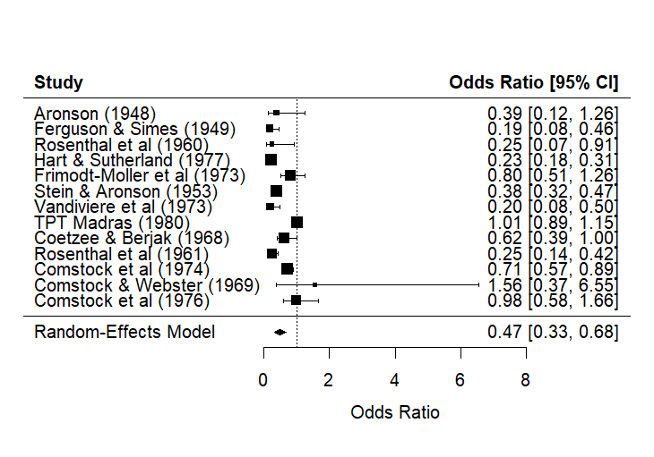

# Meta-Analysis-BCG-Vaccination-TB-Prevention
## Overview
I utilized RStudio to evaulate the efficacy of bacillus Calmette-Guerin (BCG) vaccination on tuberculosis across multiple clinical trials. I conducted this meta-analysis using summary data obtained from the metafor R package `dat.bcg`, which compiled randomized controlled trials (RCTs) evaluating the efficacy of BCG vaccination against tuberculosis. 

The `dat.bcg` dataset included 13 RCTs conducted between 1948 and 1980.

[Click here to view the dat.bcg data](data/dat_bcg.csv)

## Data
The dataset includes trial-level counts of TB cases and non-cases in vaccinated and control groups, along with study-level characteristics such as:
- Allocation method (random vs systematic)
- Absolute latitude of study location 

Data preparation steps are documented in [data_prep](code/data_prep). I created a "study label" variable for the forest plot.

## Methods
Given the variability in study design and sample size of included trials, I conducted a random-effects meta-analysis. I used restricted maximum likelihood (REML) estimation to generate a pooled odds ratio (OR) and corresponding 95% confidence interval (CI) for the association between BCG vaccination and TB.

After conducting the analysis, I assessed for heterogeneity using Q-statistics and I².

To explore the impact of heterogeneity, meta-regression was performed to evaluate the impact of allocation method and absolute latitude on treatment effects.

All analyses were performed in R using the `metafor` package.  
Analysis scripts:
- [Meta-analysis](code/meta-analysis)
- [Meta-regression](code/meta-regression)

## Results
### Meta-Analysis

The pooled analysis demonstrated a significant protective effect of BCG vaccination against TB (OR = 0.47, 95% CI: 0.33–0.68):

| Model           | OR    | 95% CI        | SE    | p-value |
|----------------|-------|---------------|-------|---------|
| Random-effects | 0.47 | 0.33 – 0.68 | 0.186 | <0.001  |

This suggests that BCG vaccination was associated with a 53% reduction in the odds of developing TB compared to controls.

However, substantial heterogeneity was observed. The I² statistic indicated that approximately 92% of the total variability in observed effect sizes was attributable to heterogeneity rather than sampling error, which was supported by a statistically significant Cochran’s Q test (p < 0.001).

### Meta-regression
Meta-regression analyses indicated that absolute latitude was significantly associated with treatment effects and explained a substantial proportion of between-study heterogeneity. Allocation method was not significantly associated with the observed effect sizes.

Detailed regression results are available here:
- [Meta-regression results table](Output/meta-regression.csv)
- [Heterogeneity summary](Output/heterogeneity.csv)

### Funnel Plot 
The funnel plot suggests a relatively symmetric distribution of studies.

